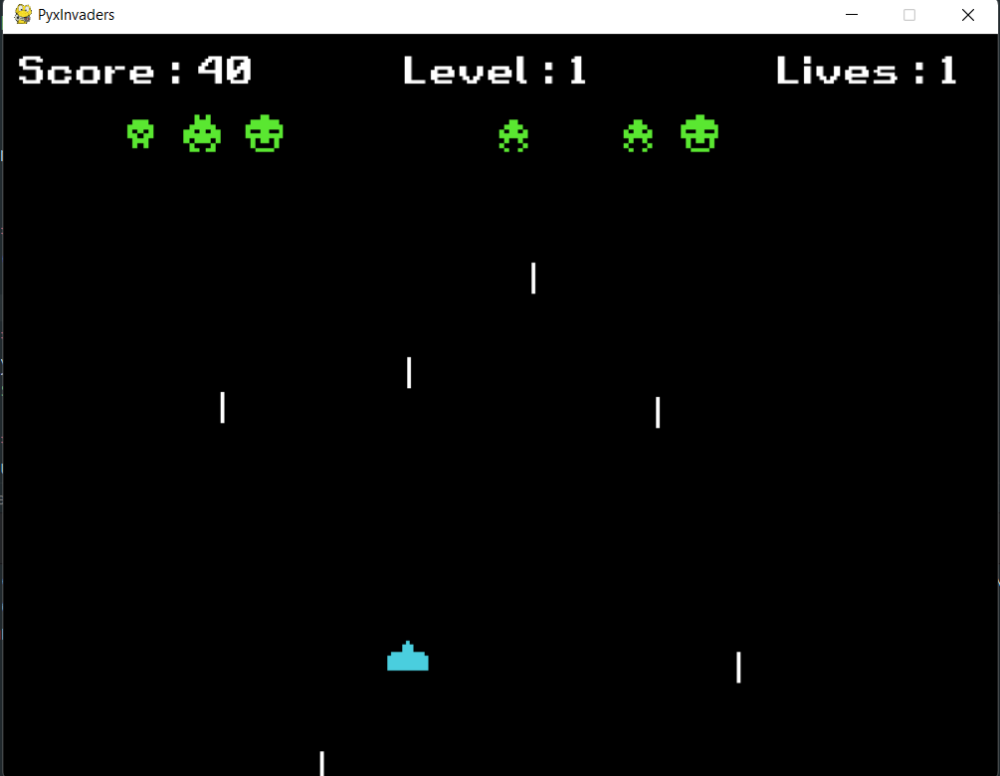
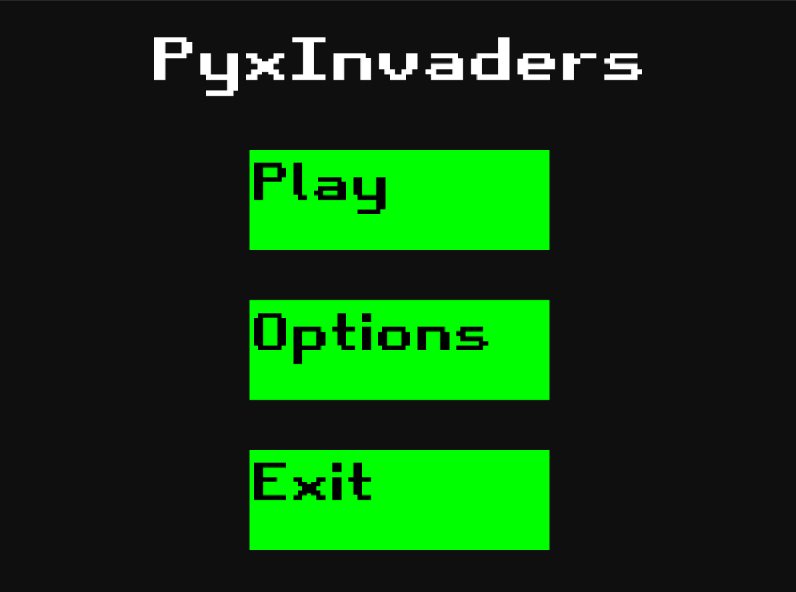

# PyxInvaders

Literally a copy of Space Invaders arcade game. Although it is a easy to implement game (to some extend) 
I am having fun while making it. Used PyGame as a game library and Python as a langauge. It is a good way to learn
other language by making easy to implement project yet requiring to learn specific aspects of lang.

# Preview images

